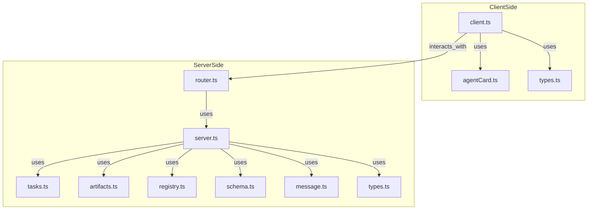
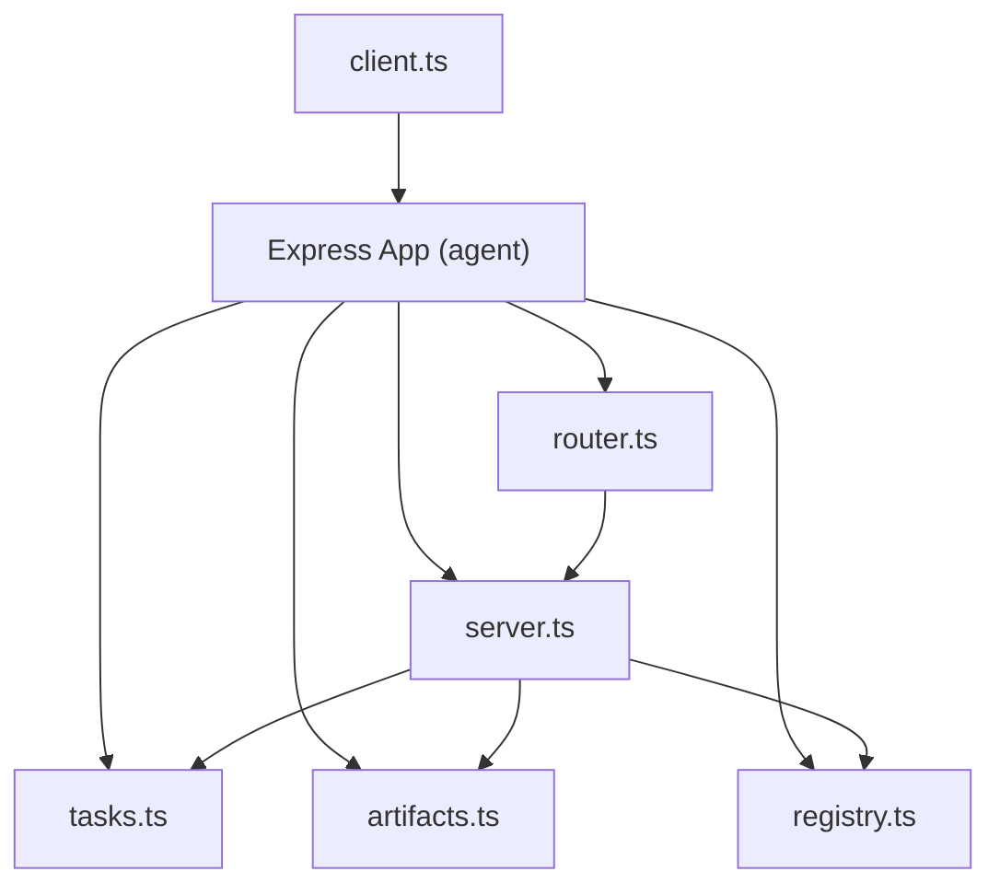

# A2A Module: Detailed Design

This document describes the design and responsibilities of the `src/core/a2a/` module, which implements the Agent-to-Agent (A2A) protocol for agent registration, discovery, and communication.

## Purpose
- Enable agents to register themselves and discover others via agent cards.
- Provide A2A-compliant client and server helpers for message exchange.
- Support robust, type-safe task routing and delegation.

## Key Components

| File           | Purpose                                                      |
|----------------|--------------------------------------------------------------|
| agentCard.ts   | Agent card creation, validation, and fetching                |
| registry.ts    | Agent registry and discovery                                 |
| client.ts      | A2A protocol client helpers                                  |
| server.ts      | A2A protocol server handlers (delegates to logic modules)    |
| router.ts      | Express router setup for all A2A endpoints                   |
| tasks.ts       | In-memory (or persistent) task/message management            |
| artifacts.ts   | In-memory (or persistent) artifact management                |
| schema.ts      | JSON schema validation for A2A messages                      |
| message.ts     | Message/part encoding/decoding utilities                     |
| types.ts       | TypeScript types/interfaces for A2A protocol                 |

## Modular Responsibilities

- **tasks.ts**: All business logic for creating, updating, retrieving, and canceling tasks and messages.
- **artifacts.ts**: Logic for storing and retrieving artifacts produced by tasks.
- **server.ts**: Thin HTTP handlers for each A2A endpoint; delegates to `tasks.ts` and `artifacts.ts`.
- **router.ts**: Sets up an Express router with all A2A endpoints, using handlers from `server.ts`.

## Design Rationale
- **Modularity:** Each file has a single responsibility, making the system easy to extend and maintain.
- **Type Safety:** All A2A data structures are defined in TypeScript types/interfaces.
- **Protocol Compliance:** All messages and agent cards are validated against the A2A specification.

## Example Flows

### Agent Registration
1. Fetch agent card from a remote agent.
2. Validate the card.
3. Register the agent in the local registry.

```ts
import { fetchAgentCard, validateAgentCard } from './agentCard';
import { AgentRegistry } from './registry';

const registry = new AgentRegistry();
const card = await fetchAgentCard('https://worker.example.com/.well-known/agent.json');
if (validateAgentCard(card)) {
  registry.register(card);
}
```

### Task Creation (Handler Delegation)
```ts
// In router.ts
router.post('/tasks/send', handleSendTask);

// In server.ts
export async function handleSendTask(req, res) {
  const createdTask = tasks.createTask(req.body);
  res.status(201).json(createdTask);
}

// In tasks.ts
export function createTask(payload) { /* ... */ }
```

### Artifact Retrieval
```ts
// In server.ts
export async function handleGetArtifacts(req, res) {
  const artifacts = artifactsStore.getArtifactsForTask(req.params.id);
  res.json(artifacts);
}
```

### Agent Discovery
```ts
const agents = registry.findByCapability('summarization');
```

### Task Delegation
```ts
import { sendTask } from './client';
const agent = agents[0];
const response = await sendTask(agent.endpoint, taskPayload);
```

## Client and Server Architecture

The A2A module provides both client and server helpers for agent-to-agent communication. This section illustrates how the client and server relate to other files in the module, both at the file/module level and at runtime.

### File/Module Relationships



- `client.ts` is used by agents to send A2A protocol requests to other agents.
- `server.ts` provides endpoint handlers, which are mounted by `router.ts` in an Express app.
- Both client and server use shared types, schema validation, and message utilities.

### Runtime Relationships



- At runtime, the Express app mounts the A2A router, which delegates to server handlers.
- Server handlers delegate to business logic modules (tasks, artifacts, registry).
- The client sends HTTP requests to the server's endpoints, enabling agent-to-agent communication.

## Future Enhancements
- Persistent registry (database-backed)
- Dynamic agent registration via API
- Advanced routing (multi-agent, fallback, load balancing)

## References
- [A2A Protocol Spec](https://google.github.io/A2A/#/documentation)
- [A2A Agent Card Spec](https://google.github.io/A2A/specification/agent-card/) 